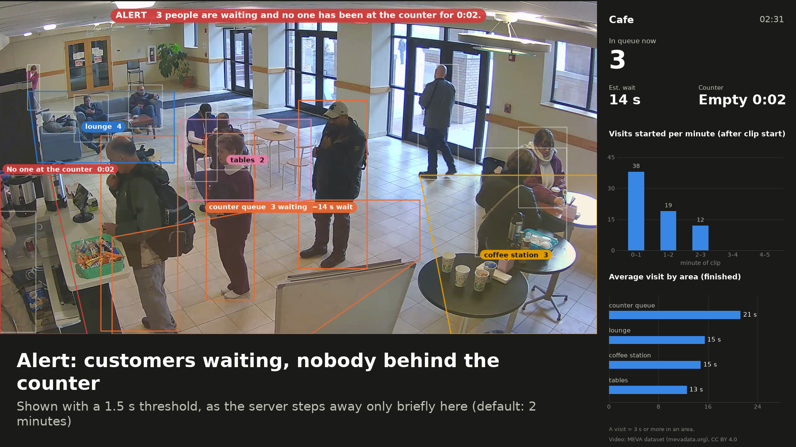
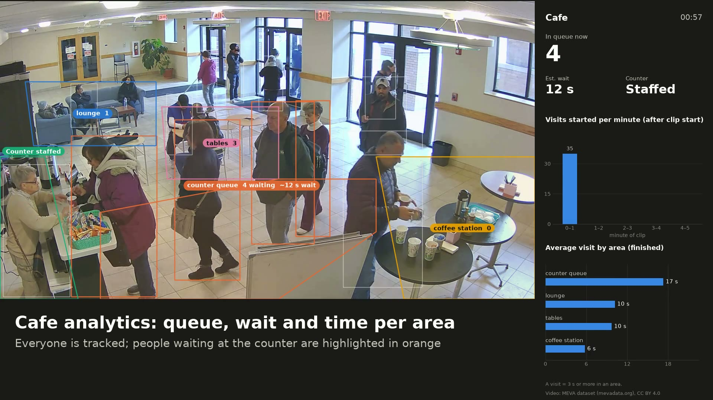
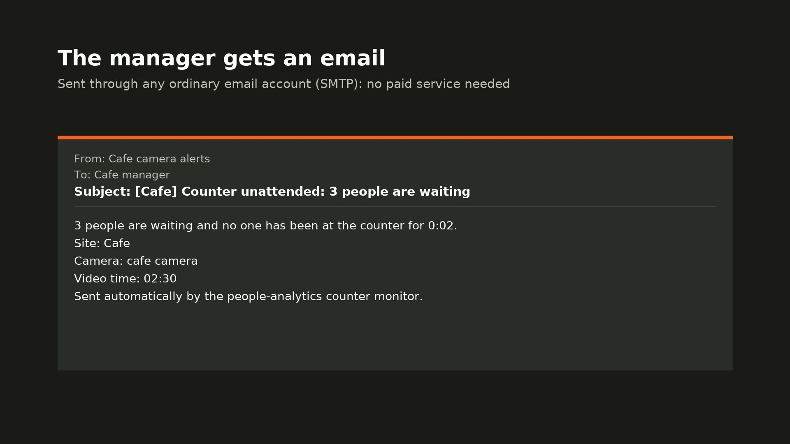
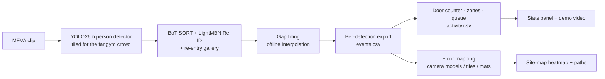

# People Counting, Dwell Time & Heatmaps with Occlusion-Robust Tracking

Footfall analytics for any venue (shop, café, mall entrance, campus), shown on the
public MEVA surveillance dataset: a café queue with wait estimate and time per area,
an alert (with email) when customers wait at an unattended counter, people counted
in and out of a building entrance, and four cameras combined on one floor plan as a
heatmap with walking paths. Identities are held through crowds and occlusions,
because every count and dwell time depends on that.

**Video: MEVA dataset (mevadata.org), CC BY 4.0**



The 56-second demo video (café camera) is built by `people-analytics demo-video`
(`outputs/meva/demo/meva_demo.mp4`, not tracked in git).

| Café: queue and time per area | The alert email |
|---|---|
|  |  |

## What it does

| Feature | Where | How |
|---|---|---|
| Door counting | East doors (MEVA G420) | Two lines across the doorway; a count needs the feet to cross both, in order, so a person standing on the threshold can't be counted twice |
| Dwell time per area | Café (G421), gym (G330) | Time each tracked person spends in each floor area; visits under 3 s ignored |
| Queue length and wait | Café counter | Slow-moving people in front of the counter; wait = median of recent visits |
| Unattended-counter alert | Café counter | Nobody behind the counter for 2 minutes (configurable) while people wait: on-screen alert, event log entry and email |
| Email notifications | Any site | Plain SMTP through an ordinary mail account (Gmail, Outlook…), so no paid service; every alert is also saved as an `.eml` file |
| Zone editor | Any camera | Draw areas, the queue and the staff area on the scene by clicking; saved into the config |
| Site-map heatmap | All four cameras | Each camera's floor mapped to metres, rooms placed on one plan, heat + walking paths ([still](outputs/portfolio/meva_site_heatmap.jpg)) |
| Stats panel | Beside the video | Footfall per minute, running totals, average visit by area (matplotlib) |

## Results

Measured in this repo on MEVA's own annotations, on clips the system was **not**
tuned on (each camera was tuned on a different clip; see
[`metrics/meva_tuning.md`](metrics/meva_tuning.md)). Full method and caveats:
[`metrics/meva_eval.md`](metrics/meva_eval.md).

**Door counting** — `2018-03-09.10-40-01.10-45-01.school.G420` (5 min), against
MEVA's enter/exit-scene labels:

| | MEVA labels | Counted | Matched | Missed | False counts |
|---|---:|---:|---:|---:|---:|
| IN | 13 | 14 | 13 | 0 | 1 |
| OUT | 59 | 51 | 50 | 9 | 1 |
| **Total** | **72** | **65** | **63** | **9** | **2** |

**Identity switches through crowds** — full 5-minute clips, counted on the people
MEVA annotates, same detections for both trackers:

| Clip | This system | ByteTrack (motion only) | Change |
|---|---:|---:|---:|
| Café `2018-03-07.17-20-00.17-25-00.school.G421` | 107 | 162 | −34% |
| East doors `2018-03-09.10-40-01.10-45-01.school.G420` | 53 | 62 | −15% |

Recall on the annotated people is the same within 2 points (0.724 vs 0.745 café,
0.720 vs 0.718 doors).

**Dwell time** — 15 café visits drawn at random and timed by hand: **median error
9.3 s, mean 65.8 s**. Visits one track covered from start to end are timed well
(7 of 15 within 0.6 s). Long stays in a crowd (queueing for minutes, sitting on
the sofa) break into pieces, often under new ids, and are badly under-timed. Long
dwell times and the queue wait estimate should therefore be read as lower bounds.

## How it works



- **Detection**: Ultralytics YOLO26m. The gym adds 640 px tiles fused with a
  full-frame pass, which recovers the small, far people.
- **Tracking**: BoT-SORT with LightMBN appearance features, plus a re-entry gallery
  that gives a returning person their old id. Settings were chosen per camera on a
  separate tuning clip: gallery threshold 0.65 at the doors and café, gallery off
  in the dense gym crowd, camera-motion compensation off (fixed cameras).
- **Door counter** ([`analytics/door.py`](src/people_analytics/analytics/door.py)):
  outer and inner line; crossings need both lines in order, a short settle time
  and a 1 s cooldown, which stops shuffling and crowd overlap counting twice.
- **Counter staff monitor** ([`analytics/staff.py`](src/people_analytics/analytics/staff.py)):
  someone's box centre inside the area behind the counter means it's staffed (the
  counter hides legs, so feet aren't used). The state only flips after holding for
  a second, so a missed detection or a passer-by doesn't count.
- **Floor mapping** ([`analytics/floor.py`](src/people_analytics/analytics/floor.py)):
  the gym uses MEVA's calibrated camera models; the café is fitted from its
  12-inch floor tiles; the entrance from its two 4×6 ft mats. Checks in
  [`metrics/meva_floor.md`](metrics/meva_floor.md).
- **Everything downstream replays exports**: the event log, panel, composite
  videos and the demo are rebuilt from `*_events.csv` without tracking again.

## Run it

Requires Python 3.11, [`uv`](https://docs.astral.sh/uv/), `ffmpeg` and ideally a
CUDA GPU. On an RTX 3080 a 5-minute clip took 27 minutes (entrance) and 30 minutes
(café), and 45–46 minutes for each tiled gym camera; the tracker itself runs at ~8 FPS.

```bash
# Environment
uv venv --python 3.11
uv pip install torch torchvision --index-url https://download.pytorch.org/whl/cu121
uv pip install -e ".[detect,track,eval,app,edge,dev]"

# Data: MEVA annotations + metadata, then the clips (anonymous S3, 85–220 MB each;
# the full shortlist is 16 clips / 2.6 GB, the demo needs only the 4 in meva_sitemap.yaml)
git clone --depth 1 https://gitlab.kitware.com/meva/meva-data-repo data/meva/meva-data-repo
people-analytics meva-rank          # rank annotated clips -> outputs/meva/clip_stats.csv
people-analytics meva-fetch         # shortlist in configs/meva_candidates.yaml -> data/meva/clips/

# Analytics per camera (events, activity log, summary)
people-analytics analyze --config configs/meva_entrance.yaml --no-video
people-analytics analyze --config configs/meva_cafe.yaml --no-video
people-analytics analyze --config configs/meva_gym.yaml --no-video
people-analytics analyze --config configs/meva_gym_g299.yaml --no-video

# Draw your own zones, queue and staff area (opens a window; W saves, H help)
people-analytics zone-editor --config configs/meva_cafe.yaml

# Alerts: list them from a run, send them, or test the email settings
people-analytics alerts --config configs/meva_cafe.yaml [--send]
people-analytics notify-test --config configs/meva_cafe.yaml

# Site map, evaluation, video
people-analytics sitemap            # -> outputs/meva/sitemap/site_heatmap.png
people-analytics meva-eval-doors    # -> metrics/meva_doors_eval.json
people-analytics meva-idsw --config configs/meva_cafe.yaml
people-analytics composite --config configs/meva_cafe.yaml --title Cafe --seconds 30
people-analytics demo-video         # -> outputs/meva/demo/meva_demo.mp4
```

### Email alerts

Alerts always go to `notify.outbox_dir` as `.eml` files. To email them as well, set
`notify.email` in the scene config (`enabled: true`, `username`, `sender`, `to`) and put
an app password in the `ALERT_SMTP_PASSWORD` environment variable; the password is
never stored in a file. For Gmail: turn on 2-step verification, create an app password
at myaccount.google.com/apppasswords, and keep `smtp.gmail.com`, port 587. Then run
`people-analytics notify-test` to check it.

The KF1 metadata zip (camera list, site-map PDF) comes from
[data.kitware.com](https://data.kitware.com/#item/5ce40a518d777f072bc1e920); see
[`data/README.md`](data/README.md).

## Limits

- **The unattended-counter alert has no real 2-minute case in MEVA.** The café is
  staffed whenever it is open (99% of frames in the demo clip; the longest gap is
  2 s), so the demo shows the alert on that real 2-second gap with the threshold
  lowered to 1.5 s, and says so on screen.
- **Long stays are under-timed** in crowds (see Results). Short visits are accurate.
- **The floor plan is schematic.** MEVA has no building plan: each room's floor is
  measured, but where the rooms sit relative to each other is approximate, and each
  room on the map is its own 5-minute clip, not the same moment.
- **The café and entrance cameras have no lens model**, so their floor mapping is
  least accurate towards the image edges.
- **ID-switch counts cover only people MEVA annotates** (those taking part in a
  labelled activity), matched at IoU ≥ 0.3 because MEVA's boxes are loose.
- **The gym crowd is detection-limited**: recall on annotated people was 0.34 on the
  tuning clip even with tiling; its tracks are fragmented, so its per-area visitor
  counts are not meaningful (it is used for the heatmap).

## Repo layout

```
configs/meva_*.yaml          scene configs (doors, zones, queue, tracker), site plan, demo shots
src/people_analytics/
  analytics/                 pipeline, door, queue, staff, dwell, activity log, floor, sitemap, panel
  data/meva.py               MEVA clip ranking, download, annotations
  tracking/                  BoxMOT wrapper, per-clip tuning harness
  eval/                      MEVA door and dwell evaluation
  demo.py                    demo video from a shot list
  zone_editor.py             draw zones / queue / staff area and save to a config
  notify.py                  email alerts (SMTP) and the .eml outbox
metrics/                     tuning, floor calibration, evaluation (all from runs here)
outputs/portfolio/meva_*     README stills (tracked); other outputs are gitignored
```

The package also carries earlier tooling (MOT20 benchmark, Streamlit dashboard,
ONNX/TensorRT edge export) behind the same `people-analytics` CLI.

## Data & licences

- **Video and annotations**: MEVA dataset (mevadata.org), CC BY 4.0. Kitware Inc. and
  IARPA; K. Corona et al., *MEVA: A Large-Scale Multiview, Multimodal Video Dataset
  for Activity Detection*, WACV 2021. All actors signed consent forms.
- **Code**: MIT, see [`LICENSE`](LICENSE). Detection uses Ultralytics YOLO (AGPL-3.0),
  which is fine for this open demo but matters if the code is ever closed-source.
- **Fonts**: DejaVu Sans (free licence), bundled with matplotlib.
